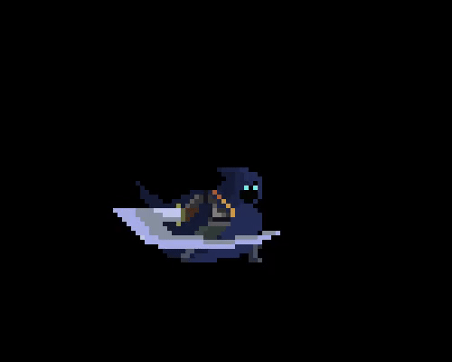
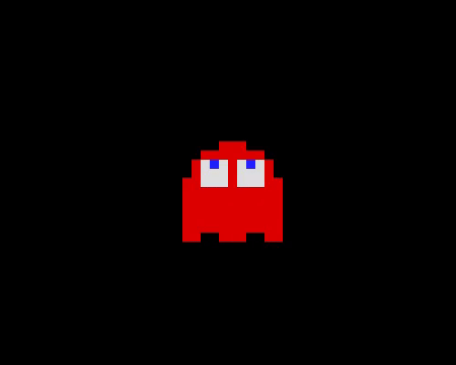

# Project README

To compile the project, ensure you have `g++` and the SFML library installed on your system.

Compile the project using the following command:

```bash
g++ *.cpp -lsfml-graphics -lsfml-window -lsfml-system -o animation
```

To run it, execute the `animation` file:

```bash
./animation
```

## Demo Samples

1. **The Swordsman Character**

   

2. **The Pacman Red Ghost Character**

   

```

```
